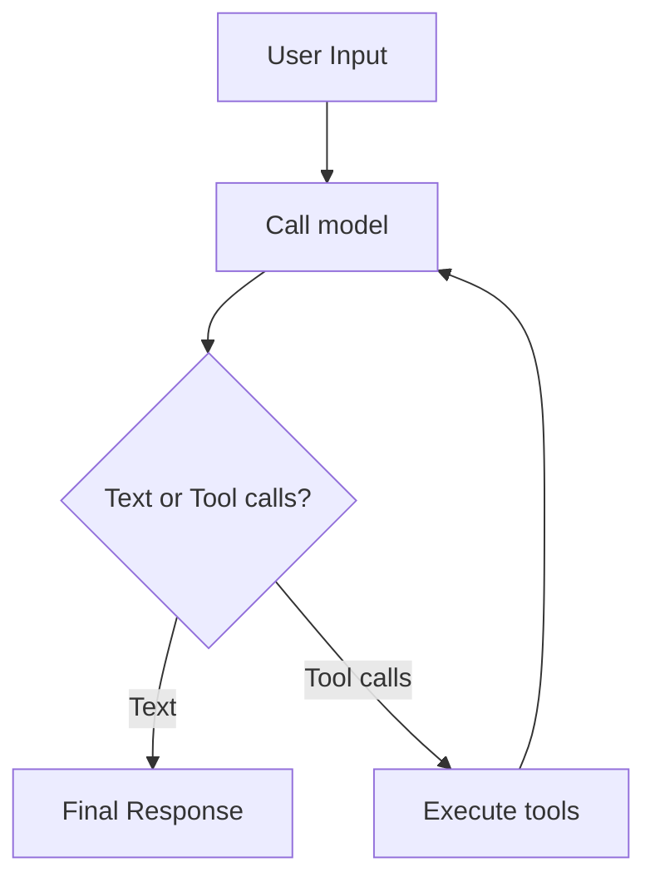

# Definable Docs — Writing & Updating

## Golden Rule

Code is truth. Docs follow code, never the other way around. Read the relevant source before writing or editing any documentation.

## File Locations

| What | Where |
|------|-------|
| Mintlify pages | `definable/docs/<section>/<page>.mdx` |
| Navigation config | `definable/docs/docs.json` |
| Main README | `README.md` |
| Examples | `definable/examples/<category>/NN_name.py` |
| Source code | `definable/definable/<module>/` |

## Audit-Before-Edit Workflow

Never write docs blind. Before any edit:

1. **Read the source code** for the feature being documented
2. **Read the existing doc page** (if updating)
3. **Compare** — classify each section as ACCURATE, STALE, MISSING, ORPHANED, or INCOMPLETE
4. **Apply the misleading test**: "Would a developer write incorrect code from this doc?" If no, skip it
5. **Edit surgically** — only change what's wrong. Preserve structure, voice, and accurate sections

## MDX Page Structure

Every Mintlify page follows this pattern:

```mdx
---
title: "Page Title"
sidebarTitle: "Short Title"
description: "One-line description for SEO and sidebar hover."
icon: "icon-name"
---

Opening paragraph — one sentence explaining what this feature is and why it matters.

## Core Section

Explanation with a code example.

```python
from definable.agents import Agent
from definable.models import OpenAIChat

agent = Agent(model=OpenAIChat(id="gpt-4o"), instructions="...")
output = agent.run("Hello")
```

## Configuration / Parameters

Table or `<ParamField>` blocks documenting options.

## Next Steps / See Also

`<CardGroup>` linking to related pages.
```

### Frontmatter Fields

| Field | Required | Notes |
|-------|----------|-------|
| `title` | Yes | Full page title |
| `sidebarTitle` | No | Shorter label for sidebar (use when title is long) |
| `description` | Yes | One sentence, used in SEO meta and sidebar hover |
| `icon` | Yes | Lucide icon name (e.g., `robot`, `wrench`, `database`, `brain`) |

## Mintlify Components

Use these components. Do NOT invent custom ones or use raw HTML.

### CardGroup + Card — Link grids

```mdx
<CardGroup cols={2}>
  <Card title="Configuration" icon="gear" href="/agents/configuration">
    Brief description of what this link covers.
  </Card>
  <Card title="Testing" icon="flask-vial" href="/agents/testing">
    Test agents without API calls using MockModel.
  </Card>
</CardGroup>
```

### CodeGroup — Tabbed code (sync/async, multiple languages)

```mdx
<CodeGroup>
```python Sync
output = agent.run("Hello")
```

```python Async
output = await agent.arun("Hello")
```
</CodeGroup>
```

### ParamField — Constructor/config parameter docs

```mdx
<ParamField path="db_path" type="str" default="./memory.db">
  Path to the SQLite database file. Created automatically if it doesn't exist.
</ParamField>

<ParamField path="pool_size" type="int" default={5}>
  Connection pool size.
</ParamField>
```

- Use `default="string"` for string defaults
- Use `default={number}` (JSX expression) for numeric defaults
- Use `default="None"` for optional params

### Callout Boxes

```mdx
<Tip>
  A common pattern is to retrieve more candidates than needed and let the reranker select the best results.
</Tip>

<Warning>
  Never commit API keys. Use environment variables instead.
</Warning>

<Info>
  This feature requires the `readers` extra: `pip install definable[readers]`
</Info>

<Note>
  Structured output requires a Pydantic BaseModel as the response_format.
</Note>
```

### Accordion — Collapsible sections

```mdx
<Accordion title="Full parameter reference">
  Detailed content hidden by default.
</Accordion>
```

### Tables — Standard markdown

```mdx
| Option | Type | Default | Description |
|--------|------|---------|-------------|
| `name` | `str` | Function name | Tool name shown to the model |
| `strict` | `bool` | `False` | Enable strict parameter validation |
```

### Mermaid Diagrams

````mdx

````

- Do NOT use numbered prefixes in node labels (e.g., `"1. Step"`) — Mermaid parses them as markdown lists
- Wrap labels with special characters in double quotes

## MDX Pitfalls

| Problem | Cause | Fix |
|---------|-------|-----|
| `Unexpected character before name` | Bare `<` in text (e.g., `<100`) | Rephrase: "fewer than 100" or use `&lt;` |
| `Unsupported markdown: list` | Numbered text in Mermaid nodes | Remove number prefixes from node labels |
| Component not rendering | Wrong casing or typo | Use exact component names: `CardGroup`, `CodeGroup`, `ParamField` |
| Page not found | Missing from navigation | Add to `definable/docs/docs.json` |

## Code Examples in Docs

Every code example must be **copy-pasteable and correct**.

### Rules

1. Import paths must match the actual public API
2. Class/function names must exist in the current codebase
3. Constructor signatures must match current code (required params, defaults)
4. If an example needs an API key, mention it above the code block
5. Use `gpt-4o-mini` as the default model in examples (fast, cheap)
6. Use 4-space indentation in code blocks (standard Python, even though the framework source uses 2-space)

### Standard Import Patterns

```python
# Models
from definable.models import OpenAIChat
from definable.models import DeepSeekChat, MoonshotChat, xAI

# Agents
from definable.agents import Agent, AgentConfig
from definable.agents import KnowledgeConfig, MemoryConfig, ThinkingConfig

# Tools
from definable.tools.decorator import tool

# Knowledge
from definable.knowledge import Knowledge, Document

# Memory
from definable.memory import Memory, SQLiteStore

# Interfaces
from definable.interfaces.telegram import TelegramInterface, TelegramConfig
```

### Sync/Async Examples

When a feature has both sync and async usage, show both in a `<CodeGroup>`:

```mdx
<CodeGroup>
```python Sync
output = agent.run("What is the capital of Japan?")
print(output.content)
```

```python Async
output = await agent.arun("What is the capital of Japan?")
print(output.content)
```
</CodeGroup>
```

## Navigation Config (docs.json)

When adding a new page, add it to `definable/docs/docs.json`.

### Navigation Structure

```json
{
  "group": "Section Name",
  "pages": [
    "section/overview",
    {
      "group": "Subsection",
      "icon": "icon-name",
      "expanded": false,
      "pages": ["section/page-a", "section/page-b"]
    }
  ]
}
```

- Top-level pages go directly in the `pages` array as strings
- Subgroups use objects with `group`, `icon`, `expanded`, and `pages`
- Use `"expanded": false` for collapsed-by-default sub-navigation
- Page references are paths relative to `definable/docs/` without the `.mdx` extension

### Existing Groups

| Group | Icon Pattern | Subsections |
|-------|-------------|-------------|
| Models | — | Providers (`server`), Advanced (`gear`) |
| Agents | — | Capabilities (`layer-group`), Advanced (`gear`) |
| Tools | — | Toolkits (`toolbox`), Advanced (`gear`) |
| Interfaces | — | Platforms (`comments`), Advanced (`gear`) |
| Memory | — | Stores (`database`), Advanced (`gear`) |
| Knowledge | — | Pipeline (`diagram-project`) |
| MCP | — | Features (`plug`), Advanced (`gear`) |

## Page Types and Templates

### Overview Page

For the main page of a module. Explains what, why, and how at a high level.

Structure: opening paragraph, optional diagram, basic example, `<CardGroup>` linking to sub-pages.

Reference: `definable/docs/agents/overview.mdx`, `definable/docs/tools/overview.mdx`

### Configuration/Reference Page

For documenting constructor params, config objects, or API options.

Structure: brief intro, table of all options or `<ParamField>` blocks, code example per section.

Reference: `definable/docs/agents/configuration.mdx`, `definable/docs/memory/stores.mdx`

### Backend/Provider Page

For documenting a specific implementation (model provider, memory store, vector DB).

Structure: one-line description, install command, minimal code example, `<ParamField>` for each constructor param.

Reference: each store section in `definable/docs/memory/stores.mdx`

### Comparison/Listing Page

For documenting multiple implementations in a single table.

Structure: intro paragraph, comparison table with columns for name/import/dependency/best-for, then individual sections below.

Reference: `definable/docs/memory/stores.mdx` (available backends table)

## Updating README.md

Only update the main README when:
- Agent constructor signature changed
- New major module added
- Install instructions changed
- Quick start example would break if copy-pasted
- Provider or backend list changed

Do NOT update for: internal refactors, minor optional params, utility functions.

Preserve badges, logos, contribution guidelines, and license sections exactly as-is.

## Validation Checklist

After writing or editing any doc:

- [ ] Every import path resolves to a real module
- [ ] Every class/function name exists in the codebase
- [ ] Every constructor call uses the current signature
- [ ] No bare `<` characters outside JSX components
- [ ] No numbered prefixes in Mermaid node labels
- [ ] New pages are added to `docs.json` navigation
- [ ] Code examples would run if copy-pasted (given the right API keys)
- [ ] `<ParamField>` defaults match the actual code defaults
- [ ] Internal links (`href="/section/page"`) point to existing pages

## Tone and Style

- Direct and concise — developers scan docs, they don't read novels
- Second person ("you") for instructions, third person for descriptions
- Present tense ("The agent returns..." not "The agent will return...")
- One idea per paragraph
- Lead with the most common/simple case, then show advanced options
- Match the voice of surrounding pages — don't impose a different style on existing docs
