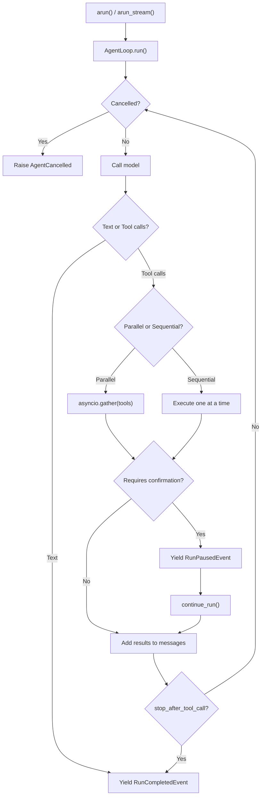

The **AgentLoop** is the unified async generator that powers both `arun()` (non-streaming) and `arun_stream()` (streaming). It yields `RunOutputEvent` instances throughout execution, handling tool dispatch, cancellation, human-in-the-loop pauses, and event emission.

## How It Works



Both `arun()` and `arun_stream()` delegate to the same `AgentLoop.run()` generator:

- **`arun()`** collects all events and builds a `RunOutput` at the end.
- **`arun_stream()`** yields events directly to the caller as they happen.

## Parallel Tool Calls

When the model returns multiple tool calls in a single response, the loop executes them in parallel using `asyncio.gather`. This is the default behavior.

```python
from definable.agent import Agent
from definable.tool.decorator import tool

@tool
def search_web(query: str) -> str:
  """Search the web."""
  return f"Results for {query}"

@tool
def search_db(query: str) -> str:
  """Search the database."""
  return f"DB results for {query}"

agent = Agent(model="openai/gpt-4o", tools=[search_web, search_db])

# If the model calls both tools at once, they run in parallel
output = await agent.arun("Find info about Python both on the web and in our database")
```

### Opting Out of Parallel Execution

Mark a tool as `sequential=True` to force it to run one-at-a-time, even when other tools in the same batch run in parallel. Use this for tools with side effects that depend on execution order.

```python
from definable.tool.function import Function

@tool
def write_file(path: str, content: str) -> str:
  """Write content to a file."""
  with open(path, "w") as f:
    f.write(content)
  return f"Wrote to {path}"

# Mark as sequential — never runs in parallel with other tools
write_file.sequential = True
```

When a batch contains both parallel and sequential tools, the loop runs all parallel tools first via `asyncio.gather`, then runs sequential tools one at a time.

## Human-in-the-Loop (HITL)

Mark a tool with `requires_confirmation=True` to pause the run before executing it. The agent yields a `RunPausedEvent` and waits for the caller to resolve the requirement.

```python
@tool
def send_email(to: str, subject: str, body: str) -> str:
  """Send an email."""
  return f"Email sent to {to}"

# Require human confirmation before sending
send_email.requires_confirmation = True

agent = Agent(model="openai/gpt-4o", tools=[send_email])
output = await agent.arun("Send an email to alice@example.com about the meeting")

# The run is paused — the tool has not executed yet
if output.is_paused:
  # Inspect what the agent wants to do
  for req in output.requirements:
    print(f"Tool: {req.tool_execution.tool_name}")
    print(f"Args: {req.tool_execution.tool_args}")

    # Approve it
    req.confirm()

  # Resume the run — the tool executes and the loop continues
  output = await agent.continue_run(run_output=output)
  print(output.content)
```

### Rejecting a Tool Call

```python
if output.is_paused:
  for req in output.requirements:
    req.reject()  # Tool will not execute

  output = await agent.continue_run(run_output=output)
```

## CancellationToken

Use a `CancellationToken` to cooperatively cancel a running agent from another coroutine or thread.

```python
import asyncio
from definable.agent import Agent
from definable.agent.cancellation import CancellationToken, AgentCancelled

agent = Agent(model="openai/gpt-4o", tools=[...])
token = CancellationToken()

async def cancel_after(seconds: float):
  await asyncio.sleep(seconds)
  token.cancel()

try:
  # Start cancellation timer and agent run concurrently
  asyncio.create_task(cancel_after(5.0))
  output = await agent.arun("Do a long research task", cancellation_token=token)
except AgentCancelled:
  print("Run was cancelled")
```

The loop checks `token.raise_if_cancelled()` at safe points — before each model call and before each tool execution. Cancellation is cooperative: the loop finishes its current atomic operation before raising `AgentCancelled`.

### CancellationToken Reference

<ParamField path="cancel()" type="method">
  Request cancellation. Thread-safe (single bool write).
</ParamField>

<ParamField path="is_cancelled" type="bool">
  Whether cancellation has been requested.
</ParamField>

<ParamField path="raise_if_cancelled()" type="method">
  Raises `AgentCancelled` if cancellation was requested.
</ParamField>

## EventBus

The `EventBus` lets you register callbacks for any event type emitted during a run. The loop calls `await bus.emit(event)` for every event, so your handlers run inline.

```python
from definable.agent import Agent
from definable.agent.events import RunCompletedEvent, ToolCallStartedEvent

agent = Agent(model="openai/gpt-4o", tools=[...])

@agent.events.on(RunCompletedEvent)
async def on_complete(event):
  print(f"Run finished: {event.content[:100]}")

@agent.events.on(ToolCallStartedEvent)
async def on_tool_start(event):
  print(f"Calling tool: {event.tool.tool_name}")

output = await agent.arun("Hello")
```

### Direct Registration

```python
# Register without decorator
async def my_handler(event):
  print(f"Event: {event}")

agent.events.on(RunCompletedEvent, my_handler)

# Unregister
agent.events.off(RunCompletedEvent, my_handler)
```

### Available Events

| Event | Emitted when |
|-------|-------------|
| `RunStartedEvent` | The agentic loop begins |
| `RunContentEvent` | A content chunk is produced (streaming) |
| `RunContentCompletedEvent` | All content chunks for one model call are done |
| `RunCompletedEvent` | The loop finishes with a final response |
| `RunPausedEvent` | A HITL tool pauses the run |
| `RunContinuedEvent` | A paused run is resumed |
| `RunErrorEvent` | An error occurs during the run |
| `RunCancelledEvent` | The run is cancelled via CancellationToken |
| `ToolCallStartedEvent` | A tool call begins |
| `ToolCallCompletedEvent` | A tool call finishes |
| `ToolCallErrorEvent` | A tool call raises an exception |
| `ReasoningStartedEvent` | The thinking phase begins |
| `ReasoningStepEvent` | A reasoning step is produced |
| `ReasoningCompletedEvent` | The thinking phase finishes |
| `KnowledgeRetrievalStartedEvent` | Knowledge retrieval begins |
| `KnowledgeRetrievalCompletedEvent` | Knowledge retrieval finishes |
| `MemoryRecallStartedEvent` | Memory recall begins |
| `MemoryRecallCompletedEvent` | Memory recall finishes |
| `MemoryUpdateStartedEvent` | Memory update begins |
| `MemoryUpdateCompletedEvent` | Memory update finishes |

All events are importable from `definable.agent.events`.

## stop_after_tool_call

Set `stop_after_tool_call=True` on a tool to make the loop stop immediately after executing it, without making another model call. This is useful for tools that produce a final result that should be returned directly.

```python
@tool
def generate_report(data: str) -> str:
  """Generate a formatted report."""
  return f"# Report\n\n{data}"

# Loop stops after this tool — no follow-up model call
generate_report.stop_after_tool_call = True

agent = Agent(model="openai/gpt-4o", tools=[generate_report])
output = await agent.arun("Generate a report from the sales data")
```

## Streaming

The loop yields events that `arun_stream()` passes through directly:

```python
async for event in agent.arun_stream("Summarize this article"):
  match event.event:
    case "RunStarted":
      print("Started...")
    case "ToolCallStarted":
      print(f"Calling: {event.tool.tool_name}")
    case "ToolCallCompleted":
      print(f"Result: {event.content[:80]}")
    case "RunContent":
      print(event.content, end="")
    case "RunCompleted":
      print("\nDone.")
```
