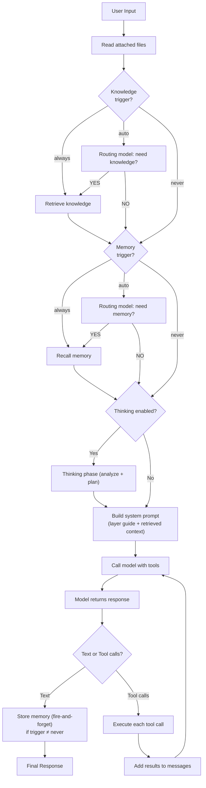

An **Agent** wraps a model with tools, instructions, and configuration to create an autonomous system that can reason, take actions, and produce structured results.

## How Agents Work

The agent follows a loop:



The loop continues until the model returns a text response with no tool calls, or the maximum iteration limit is reached.

## Creating an Agent

```python
from definable.model import OpenAIChat
from definable.agent import Agent
from definable.tool.decorator import tool

@tool
def search_docs(query: str) -> str:
    """Search the documentation for relevant information."""
    return f"Found: Documentation about {query}."

agent = Agent(
    model=OpenAIChat(id="gpt-4o"),
    tools=[search_docs],
    instructions="You are a documentation assistant. Use the search tool to find answers.",
    # memory=memory,    # Optional: persistent memory (see Memory docs)
    # readers=True,     # Optional: file reader support (see Readers docs)
    # name="my-agent",  # Optional: display name for logging
)

output = agent.run("How do I configure middleware?")
print(output.content)
```

## Key Concepts

<CardGroup cols={2}>
  <Card title="Configuration" icon="gear" href="/agents/configuration">
    Control retries, iteration limits, tracing, knowledge, compression, and more through `AgentConfig`.
  </Card>
  <Card title="Thinking" icon="lightbulb" href="/agents/thinking">
    Add a context-aware reasoning phase before responses. The agent plans its approach with tool awareness before executing.
  </Card>
  <Card title="Running Agents" icon="play" href="/agents/running-agents">
    Four execution modes: sync, async, sync streaming, and async streaming.
  </Card>
  <Card title="Multi-Turn" icon="comments" href="/agents/multi-turn">
    Maintain conversation history across multiple interactions using session IDs and message lists.
  </Card>
  <Card title="Middleware" icon="layer-group" href="/agents/middleware">
    Wrap agent execution with logging, retries, metrics, and custom logic.
  </Card>
  <Card title="Tracing" icon="chart-gantt" href="/agents/tracing">
    Export structured events from every run for debugging and observability.
  </Card>
  <Card title="Testing" icon="flask-vial" href="/agents/testing">
    Test agents without API calls using `MockModel` and `AgentTestCase`.
  </Card>
  <Card title="Memory" icon="brain" href="/memory/overview">
    LLM-driven persistent memory with automatic recall and cross-session context.
  </Card>
  <Card title="Readers" icon="file-lines" href="/readers/overview">
    Extract text from PDF, DOCX, XLSX, and audio files attached to agent messages.
  </Card>
  <Card title="Runtime" icon="server" href="/agents/runtime">
    Deploy with HTTP endpoints, webhooks, cron jobs, and messaging interfaces via agent.serve().
  </Card>
  <Card title="Authentication" icon="lock" href="/agents/auth">
    Secure HTTP endpoints with API key or JWT authentication.
  </Card>
</CardGroup>

## Agent Properties

Once created, the agent exposes useful metadata:

```python
print(agent.agent_id)     # Unique identifier
print(agent.agent_name)   # Human-readable name
print(agent.tool_names)   # ['search_docs']
```

## Adding Middleware

Chain middleware onto an agent with the fluent `.use()` method:

```python
from definable.agent import LoggingMiddleware, RetryMiddleware

agent = (
    Agent(model=model, tools=[search_docs])
    .use(LoggingMiddleware(logger))
    .use(RetryMiddleware(max_retries=3))
)
```

## Deploying with serve()

Use `agent.serve()` to start the full agent runtime — messaging interfaces, HTTP endpoints, webhooks, and cron jobs:

```python
from definable.agent.trigger import Webhook

@agent.on(Webhook("/webhook"))
async def handle(event):
  return f"Process: {event.body}"

agent.serve(telegram_interface, port=8000)
```

See [Agent Runtime](/agents/runtime) for the full runtime documentation including webhooks, cron scheduling, and dev mode. See [Multi-Interface Serving](/interfaces/multi-interface) for interface-specific details.

## Context Manager

Agents support context managers for proper resource cleanup, especially important when using toolkits with external connections:

<CodeGroup>
```python Sync
with Agent(model=model, toolkits=[mcp_toolkit]) as agent:
    output = agent.run("List files in the project.")
```

```python Async
async with Agent(model=model, toolkits=[mcp_toolkit]) as agent:
    output = await agent.arun("List files in the project.")
```
</CodeGroup>
