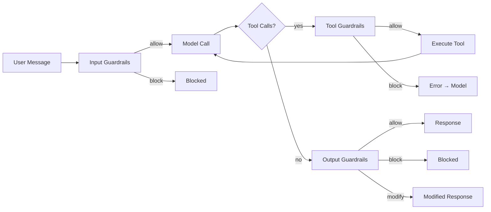

Guardrails let you enforce content policies on every agent run — blocking dangerous input, redacting PII from output, and restricting which tools the model can call.

## Quick Example

```python
from definable.agent import Agent
from definable.agent.guardrail import Guardrails, max_tokens, pii_filter, tool_blocklist
from definable.model.openai import OpenAIChat

agent = Agent(
    model=OpenAIChat(id="gpt-4o"),
    guardrails=Guardrails(
        input=[max_tokens(500)],
        output=[pii_filter()],
        tool=[tool_blocklist({"delete_all"})],
    ),
)

output = agent.run("What's my account balance?")
```

## How It Works



Three checkpoints run automatically on every `arun()` / `arun_stream()` call:

1. **Input** — after memory recall, before the model call. Can block or modify the user message.
2. **Tool** — inside the tool call loop, before each tool execution. Blocked tools send an error result back to the model.
3. **Output** — after the model response, before memory store. Can block, modify, or redact the response.

## Guardrails Constructor

```python
from definable.agent.guardrail import Guardrails

guardrails = Guardrails(
    input=[...],
    output=[...],
    tool=[...],
    mode="fail_fast",
    on_block="raise",
)
```

<ParamField path="input" type="List[InputGuardrail]" default="[]">
  Guardrails that check the user message before the LLM call.
</ParamField>

<ParamField path="output" type="List[OutputGuardrail]" default="[]">
  Guardrails that check the model response after the LLM call.
</ParamField>

<ParamField path="tool" type="List[ToolGuardrail]" default="[]">
  Guardrails that check each tool call before execution.
</ParamField>

<ParamField path="mode" type="str" default="fail_fast">
  `"fail_fast"` stops at the first block. `"run_all"` runs every guardrail and collects all results.
</ParamField>

<ParamField path="on_block" type="str" default="raise">
  `"raise"` throws `InputCheckError` or `OutputCheckError`. `"return_message"` returns a `RunOutput` with `status=RunStatus.blocked`.
</ParamField>

## Built-in Guardrails

### Input Guardrails

```python
from definable.agent.guardrail import max_tokens, block_topics, regex_filter
```

<ParamField path="max_tokens(n, model_id='gpt-4o')" type="InputGuardrail">
  Blocks input that exceeds `n` tokens. Uses the specified model's tokenizer for counting.
</ParamField>

<ParamField path="block_topics(topics)" type="InputGuardrail">
  Blocks input containing any keyword from the `topics` list (case-insensitive substring match).
</ParamField>

<ParamField path="regex_filter(patterns, action='block')" type="InputGuardrail">
  Blocks or redacts input matching any of the given regex patterns. Set `action="modify"` to redact matches instead of blocking.
</ParamField>

### Output Guardrails

```python
from definable.agent.guardrail import pii_filter, max_output_tokens
```

<ParamField path="pii_filter(action='modify')" type="OutputGuardrail">
  Detects PII (credit cards, SSN, email, phone) and redacts it with tokens like `[CREDIT_CARD]`, `[SSN]`, `[EMAIL]`, `[PHONE]`. Set `action="block"` to block the entire response instead.
</ParamField>

<ParamField path="max_output_tokens(n, model_id='gpt-4o')" type="OutputGuardrail">
  Blocks output that exceeds `n` tokens.
</ParamField>

### Tool Guardrails

```python
from definable.agent.guardrail import tool_allowlist, tool_blocklist
```

<ParamField path="tool_allowlist(allowed)" type="ToolGuardrail">
  Only allows tools whose names appear in the `allowed` set. All others are blocked.
</ParamField>

<ParamField path="tool_blocklist(blocked)" type="ToolGuardrail">
  Blocks tools whose names appear in the `blocked` set. All others are allowed.
</ParamField>

## Custom Guardrails

### Using Decorators

The fastest way to create a custom guardrail:

```python
from definable.agent.guardrail import input_guardrail, GuardrailResult

@input_guardrail
async def no_profanity(text: str, context) -> GuardrailResult:
    banned = ["badword", "offensive"]
    if any(word in text.lower() for word in banned):
        return GuardrailResult.block("Profanity detected")
    return GuardrailResult.allow()

@input_guardrail(name="length_check")
async def check_length(text: str, context) -> GuardrailResult:
    if len(text) > 10000:
        return GuardrailResult.block("Input too long")
    return GuardrailResult.allow()
```

Also available: `@output_guardrail` and `@tool_guardrail`.

### Class-Based

Implement the protocol directly for more control:

```python
from definable.agent.guardrail import GuardrailResult

class SentimentGuardrail:
    name = "sentiment_check"

    async def check(self, text: str, context) -> GuardrailResult:
        # Your custom logic here
        if is_toxic(text):
            return GuardrailResult.block("Toxic content detected")
        return GuardrailResult.allow()
```

### Modify Action

Guardrails can rewrite content instead of blocking:

```python
@output_guardrail
async def redact_names(text: str, context) -> GuardrailResult:
    cleaned = text.replace("Alice", "[REDACTED]")
    if cleaned != text:
        return GuardrailResult.modify(cleaned, reason="Names redacted")
    return GuardrailResult.allow()
```

## Composable Guardrails

Combine guardrails with logic operators:

```python
from definable.agent.guardrail import ALL, ANY, NOT, when, max_tokens, block_topics

# ALL — every guardrail must allow
strict_input = ALL(
    max_tokens(1000),
    block_topics(["violence", "exploit"]),
    name="strict_input",
)

# ANY — at least one must allow
flexible_check = ANY(
    max_tokens(5000),
    max_tokens(10000),
    name="flexible_check",
)

# NOT — invert a guardrail (allow ↔ block)
must_mention_topic = NOT(
    block_topics(["support"]),
    name="must_mention_support",
)

# when — conditional execution
admin_limit = when(
    condition=lambda ctx: ctx.user_id != "admin",
    guardrail=max_tokens(500),
    name="non_admin_limit",
)
```

## Block Handling

### Raise Exceptions (Default)

```python
from definable.exceptions import InputCheckError, OutputCheckError

agent = Agent(
    model=model,
    guardrails=Guardrails(
        input=[max_tokens(100)],
        on_block="raise",  # default
    ),
)

try:
    output = agent.run("a]very long message...")
except InputCheckError as e:
    print(f"Blocked: {e.message}")
except OutputCheckError as e:
    print(f"Output blocked: {e.message}")
```

### Return Blocked Status

```python
from definable.agent.run import RunStatus

agent = Agent(
    model=model,
    guardrails=Guardrails(
        input=[max_tokens(100)],
        on_block="return_message",
    ),
)

output = agent.run("a very long message...")
if output.status == RunStatus.blocked:
    print(f"Request was blocked: {output.content}")
```

## Tracing Events

Guardrail activity is captured in the agent's trace stream:

| Event | Fields | Emitted When |
|-------|--------|-------------|
| `GuardrailCheckedEvent` | `guardrail_name`, `guardrail_type`, `action`, `message`, `duration_ms` | After each check completes |
| `GuardrailBlockedEvent` | `guardrail_name`, `guardrail_type`, `reason` | When a guardrail blocks |

## What's Next

<CardGroup cols={2}>
  <Card title="Agents Overview" icon="robot" href="/agents/overview">
    Learn how agents orchestrate models, tools, and guardrails.
  </Card>
  <Card title="Middleware" icon="layer-group" href="/agents/middleware">
    Add request/response transforms alongside guardrails.
  </Card>
  <Card title="Testing" icon="vial" href="/agents/testing">
    Use MockModel to test guardrail behavior without API calls.
  </Card>
  <Card title="Error Handling" icon="triangle-exclamation" href="/advanced/error-handling">
    Handle InputCheckError, OutputCheckError, and other exceptions.
  </Card>
</CardGroup>
