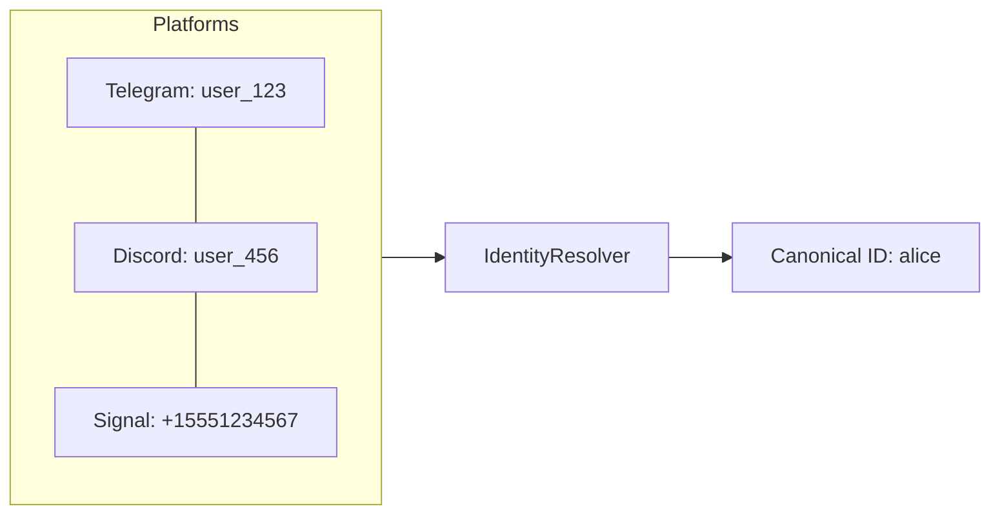

When the same person uses your agent on both Telegram and Discord, they appear as two different users with separate memory stores. Identity resolution merges these into a single canonical identity, so the agent remembers context across platforms.

## How It Works



The `IdentityResolver` maps `(platform, platform_user_id)` pairs to a single `canonical_user_id`. This canonical ID is then used for memory scoping, so all platforms share the same memory store.

## Quick Example

```python
from definable.agent.interface import (
    SQLiteIdentityResolver,
    TelegramInterface,
    TelegramConfig,
    DiscordInterface,
    DiscordConfig,
    serve,
)

# Create a shared identity resolver
resolver = SQLiteIdentityResolver(db_path="./identity.db")

# Link platform accounts to canonical IDs
async with resolver:
    await resolver.link("telegram", "123456", "alice", username="Alice T")
    await resolver.link("discord", "789012", "alice", username="Alice D")

# Both interfaces use the same resolver
telegram = TelegramInterface(
    agent=agent,
    config=TelegramConfig(bot_token="..."),
    identity_resolver=resolver,
)

discord = DiscordInterface(
    agent=agent,
    config=DiscordConfig(bot_token="..."),
    identity_resolver=resolver,
)

# Messages from either platform resolve to user_id="alice"
await serve(telegram, discord, identity_resolver=resolver)
```

## IdentityResolver Protocol

Any identity resolver must implement:

| Method | Description |
|--------|-------------|
| `await initialize()` | Set up the resolver (create tables, connect) |
| `await close()` | Clean up resources |
| `await resolve(platform, platform_user_id)` | Get the canonical user ID, or `None` if not linked |
| `await link(platform, platform_user_id, canonical_user_id, username=None)` | Create or update a link |
| `await unlink(platform, platform_user_id)` | Remove a link. Returns `True` if a link was removed |
| `await get_identities(canonical_user_id)` | Get all platform identities for a canonical user |

## SQLiteIdentityResolver

The built-in implementation uses SQLite for persistence:

```python
from definable.agent.interface import SQLiteIdentityResolver

resolver = SQLiteIdentityResolver(db_path="./identity.db")
```

<ParamField path="db_path" type="str" default="./identity.db">
  Path to the SQLite database file. Created automatically.
</ParamField>

Supports async context manager:

```python
async with SQLiteIdentityResolver(db_path="./identity.db") as resolver:
    await resolver.link("telegram", "123", "alice")
    user_id = await resolver.resolve("telegram", "123")  # "alice"
```

## PlatformIdentity

The `get_identities()` method returns `PlatformIdentity` objects:

| Field | Type | Description |
|-------|------|-------------|
| `platform` | `str` | Platform name (e.g., `"telegram"`, `"discord"`) |
| `platform_user_id` | `str` | User ID on that platform |
| `canonical_user_id` | `str` | The shared canonical ID |
| `username` | `str \| None` | Optional display name |
| `linked_at` | `float` | Unix timestamp of when the link was created |

## Integration with BaseInterface

Pass `identity_resolver` when creating any interface:

```python
interface = TelegramInterface(
    agent=agent,
    config=config,
    identity_resolver=resolver,
)
```

When a message arrives, the interface calls `resolver.resolve(platform, platform_user_id)` before creating the agent session. If a canonical ID is found, it's used as the `user_id` for memory and session scoping.

## Integration with serve()

When using `serve()` for multi-interface deployments, pass the resolver once and it propagates to all interfaces:

```python
await serve(
    telegram_interface,
    discord_interface,
    signal_interface,
    identity_resolver=resolver,
)
```
