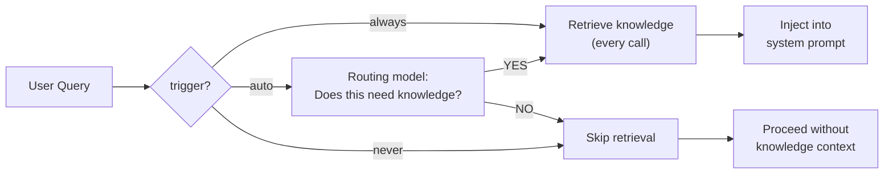

There are two ways to give an agent access to a knowledge base:

| Approach | How It Works | When to Use |
|----------|-------------|-------------|
| **KnowledgeMiddleware** | Automatically retrieves context before every model call | Always-on RAG |
| **KnowledgeToolkit** | Agent decides when to search | Selective, multi-step reasoning |

## KnowledgeMiddleware (Automatic)

The middleware automatically searches the knowledge base using the user's message and injects relevant context into the system prompt. The agent doesn't need to do anything special — the context is always there.

```python
from definable.agent import Agent
from definable.embedder import OpenAIEmbedder
from definable.knowledge import Knowledge
from definable.vectordb import InMemoryVectorDB
from definable.model import OpenAIChat

# Build knowledge base
knowledge = Knowledge(
    vector_db=InMemoryVectorDB(),
    embedder=OpenAIEmbedder(),
    top_k=5,
    rerank=True,
)
knowledge.add("Definable supports OpenAI, DeepSeek, Moonshot, and xAI.")
knowledge.add("Agents combine models, tools, and knowledge.")

# Pass knowledge directly to Agent
agent = Agent(
    model=OpenAIChat(id="gpt-4o"),
    knowledge=knowledge,
    instructions="Answer questions using the provided context.",
)

output = agent.run("What models does Definable support?")
print(output.content)
```

### Knowledge Parameters

These parameters are passed directly to the `Knowledge` constructor:

<ParamField path="vector_db" type="VectorDB" required>
  The vector database backend for storing and searching documents.
</ParamField>

<ParamField path="embedder" type="Embedder">
  The embedder for generating vector representations. If `None`, uses the vector DB's default.
</ParamField>

<ParamField path="top_k" type="int" default="5">
  Number of documents to retrieve.
</ParamField>

<ParamField path="rerank" type="bool" default="true">
  Whether to apply reranking to search results.
</ParamField>

<ParamField path="context_format" type="str">
  Template for formatting retrieved documents in the prompt.
</ParamField>

<ParamField path="context_position" type="str" default="system">
  Where to inject context: `"system"` (in the system prompt) or `"before_user"` (before the user message).
</ParamField>

<ParamField path="query_from" type="str" default="last_user">
  Which message to use as the search query. `"last_user"` uses the latest user message.
</ParamField>

<ParamField path="trigger" type="str" default="always">
  When to activate retrieval. `"always"` retrieves on every call; `"auto"` does a lightweight model pre-check; `"never"` disables retrieval even if configured.
</ParamField>

<ParamField path="decision_prompt" type="str">
  Custom YES/NO prompt for `trigger="auto"`. If `None`, uses the default prompt asking whether the query needs the knowledge base.
</ParamField>

<ParamField path="routing_model" type="Model">
  Model to use for the `trigger="auto"` gate call. Defaults to the agent's main model. Pass a cheap model (e.g. `OpenAIChat(id="gpt-4o-mini")`) to reduce latency and cost.
</ParamField>

<ParamField path="description" type="str">
  Description shown in the layer guide injected into the system prompt. If `None`, uses the default description.
</ParamField>

## Trigger Modes

The `trigger` parameter controls when the knowledge base is queried:



| Mode | Behavior | When to Use |
|------|----------|-------------|
| `"always"` | Retrieves on every call (default) | Most RAG use cases |
| `"auto"` | Routing model gates retrieval; only queries the knowledge base when relevant | Mixed-topic agents where knowledge is needed for some queries but not others |
| `"never"` | Retrieval disabled, even if knowledge is configured | Temporarily disabling without removing configuration |

### `trigger="auto"` with a routing model

When `trigger="auto"`, a routing call decides whether retrieval is needed before the main model call. Use a cheap model to minimize cost and latency:

```python
from definable.agent import Agent
from definable.knowledge import Knowledge
from definable.model import OpenAIChat

knowledge = Knowledge(
    vector_db=...,
    embedder=...,
    trigger="auto",
    routing_model=OpenAIChat(id="gpt-4o-mini"),  # cheap routing gate
    top_k=5,
)

agent = Agent(
    model=OpenAIChat(id="gpt-4o"),
    knowledge=knowledge,
)
```

When `trigger="auto"`, the system prompt layer guide also reflects the actual retrieval state: `[retrieved this turn]` if knowledge was fetched, or `[available, not retrieved this turn]` if the gate decided to skip it.

## KnowledgeToolkit (On-Demand)

With the toolkit approach, the agent has a `search_knowledge` tool and decides when to use it:

```python
from definable.agent import Agent
from definable.agent.toolkits import KnowledgeToolkit
from definable.model import OpenAIChat

toolkit = KnowledgeToolkit(knowledge=knowledge)

agent = Agent(
    model=OpenAIChat(id="gpt-4o"),
    toolkits=[toolkit],
    instructions="Search the knowledge base when you need specific information.",
)

output = agent.run("What models does Definable support?")
```

See [KnowledgeToolkit](/toolkits/knowledge-toolkit) for full details.

## Choosing Between Middleware and Toolkit

<CardGroup cols={2}>
  <Card title="Use Middleware when...">
    - Every question needs knowledge context
    - You want zero-configuration retrieval
    - The knowledge base is focused on a single domain
    - You want the simplest setup
  </Card>
  <Card title="Use Toolkit when...">
    - Not every question needs retrieval
    - The agent should reason about when to search
    - The agent needs to search with different queries
    - You want the agent to explain its search process
  </Card>
</CardGroup>

## Full Example

A complete RAG agent with middleware, reranking, and tracing:

```python
from definable.agent import Agent, JSONLExporter
from definable.agent.tracing import Tracing
from definable.embedder import OpenAIEmbedder
from definable.knowledge import Knowledge
from definable.reranker import CohereReranker
from definable.vectordb import InMemoryVectorDB
from definable.model import OpenAIChat

# Build knowledge base
knowledge = Knowledge(
    vector_db=InMemoryVectorDB(),
    embedder=OpenAIEmbedder(),
    reranker=CohereReranker(top_n=5),
    top_k=10,
    rerank=True,
)

# Add documents
knowledge.add("/path/to/docs/")
knowledge.add("https://example.com/faq")

# Create agent — knowledge and tracing are direct Agent params
agent = Agent(
    model=OpenAIChat(id="gpt-4o"),
    instructions="You are a support agent. Answer using the provided context. If the context doesn't contain the answer, say so.",
    knowledge=knowledge,
    tracing=Tracing(
        exporters=[JSONLExporter("./traces")],
    ),
)

output = agent.run("How do I reset my password?")
print(output.content)
```
