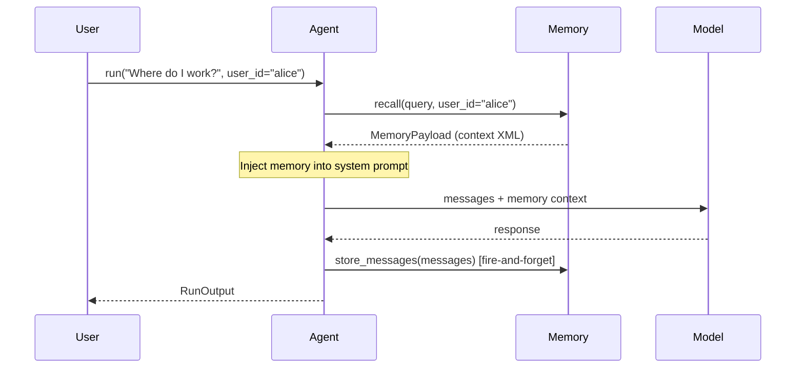

When you pass `memory=` to an `Agent`, the agent automatically recalls relevant context before each model call and stores new memories after each response.

## Setup

```python
from definable.agents import Agent
from definable.memory import CognitiveMemory, SQLiteMemoryStore
from definable.models import OpenAIChat

memory = CognitiveMemory(
  store=SQLiteMemoryStore(db_path="./memory.db"),
  token_budget=500,
)

agent = Agent(
  model=OpenAIChat(id="gpt-4o"),
  instructions="You are a helpful assistant.",
  memory=memory,
)
```

## Execution Flow



1. **Recall** — Before calling the model, the agent calls `memory.recall()` with the user's query. The returned context is injected into the system prompt.
2. **Model call** — The model receives the conversation plus the memory context, allowing it to reference past interactions.
3. **Store** — After the response, the agent fires off `memory.store_messages()` as a background task. This never blocks the response.

## Multi-User Scoping

Pass `user_id` to scope memories per user:

```python
# Alice's conversation
output = agent.run("I prefer dark mode.", user_id="alice")

# Bob's conversation — won't see Alice's preferences
output = agent.run("What theme do I prefer?", user_id="bob")
```

The `user_id` flows through `RunContext` and is passed to both `recall()` and `store_messages()`.

## Multi-Turn Conversations

Memory works alongside session-based multi-turn conversations. The `session_id` is used to group episodes within a conversation, while `user_id` scopes across all conversations:

```python
# Turn 1
output = agent.run(
  "My favorite color is blue.",
  user_id="alice",
  session_id="session-1",
)

# Turn 2 — same session, recalls from both memory and conversation history
output = agent.run(
  "What's my favorite color?",
  user_id="alice",
  session_id="session-1",
  messages=output.messages,
)
```

## Memory Events

When using `run_stream()` or `arun_stream()`, memory operations emit events:

```python
for event in agent.run_stream("Hello", user_id="alice"):
    match event.event:
        case "MemoryRecallStarted":
            print(f"Recalling memory for: {event.query}")
        case "MemoryRecallCompleted":
            print(f"Recalled {event.chunks_included} chunks "
                  f"({event.tokens_used} tokens) in {event.duration_ms}ms")
        case "MemoryUpdateStarted":
            print(f"Storing {event.message_count} messages")
        case "MemoryUpdateCompleted":
            print(f"Stored in {event.duration_ms}ms")
        case "RunContent":
            print(event.content, end="")
```

| Event | Key Fields | Description |
|-------|-----------|-------------|
| `MemoryRecallStarted` | `query` | Memory recall began |
| `MemoryRecallCompleted` | `query`, `tokens_used`, `chunks_included`, `chunks_available`, `duration_ms` | Memory recall finished |
| `MemoryUpdateStarted` | `message_count` | Memory storage began |
| `MemoryUpdateCompleted` | `message_count`, `duration_ms` | Memory storage finished |

## Non-Fatal Behavior

All memory operations are designed to be non-fatal. If a memory store is unavailable, the recall returns empty context and the store operation is logged as a warning. The agent continues to function normally without memory.

```python
# Even if the database is unreachable, the agent still works
output = agent.run("Hello!")  # Works fine, just without memory context
```

## RunContext Fields

Memory adds two fields to `RunContext`:

| Field | Type | Description |
|-------|------|-------------|
| `memory_context` | `str \| None` | The formatted memory XML injected into the system prompt |
| `user_id` | `str \| None` | User ID for memory scoping |
