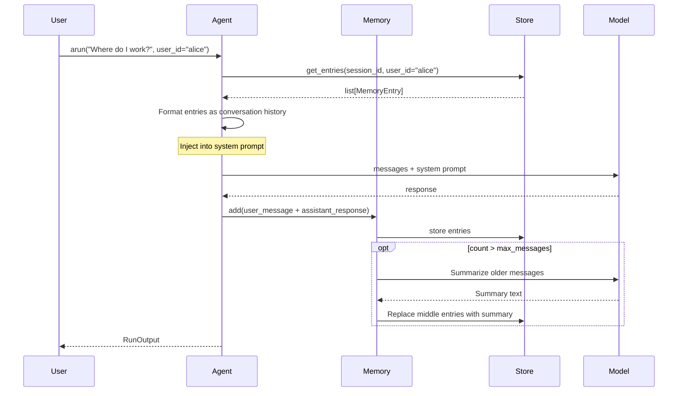

When you pass `memory=` to an `Agent`, the agent automatically injects stored conversation history before each model call and stores new messages after each response. When the session grows beyond `max_messages`, older messages are automatically summarized.

## Setup

There are two ways to add memory to an agent:

**1. `Memory` instance (recommended)**:

```python
from definable.agent import Agent
from definable.memory import Memory, SQLiteStore
from definable.model.openai import OpenAIChat

agent = Agent(
  model=OpenAIChat(id="gpt-4o"),
  instructions="You are a helpful assistant.",
  memory=Memory(store=SQLiteStore("./memory.db")),
)
```

**2. `memory=True`** — ephemeral in-memory store, useful for testing:

```python
agent = Agent(
  model=OpenAIChat(id="gpt-4o"),
  memory=True,  # Uses InMemoryStore, data lost when process exits
)
```

## Execution Flow



1. **Recall** — Before calling the model, the agent loads the session's conversation history from the store and injects it as context in the system prompt.
2. **Model call** — The model receives the conversation plus any injected memory context.
3. **Store** — After the response, the agent stores the new user and assistant messages. If the total entry count exceeds `max_messages`, the `SummarizeStrategy` runs: it pins the first few messages, summarizes the middle section, and keeps the most recent messages intact. This runs as a background task.

## Auto-Summarization

When conversation history exceeds `max_messages`, the `SummarizeStrategy` compresses it:

```
[pinned: first N messages] + [summary of middle messages] + [recent: last M messages]
```

Configure the summarization behavior:

```python
memory = Memory(
  store=SQLiteStore("./memory.db"),
  max_messages=100,   # Trigger summarization above this count
  pin_count=2,        # Always keep the first 2 messages
  recent_count=5,     # Always keep the last 5 messages
)
```

The summarization is tool-call-aware — it respects tool call boundaries so that tool requests and their results stay together in the same section.

## Multi-User Scoping

Pass `user_id` to scope memory per user:

```python
# Alice's conversation
output = await agent.arun("I prefer dark mode.", user_id="alice")

# Bob's conversation — will not see Alice's history
output = await agent.arun("What theme do I prefer?", user_id="bob")
```

The `user_id` flows through `RunContext` and is used for both recall and storage. Each user's conversation history is fully isolated.

## Multi-Turn Conversations

Memory works alongside session-based multi-turn conversations. Pass previous messages to maintain conversation continuity, while memory handles long-term history:

```python
# Turn 1
r1 = await agent.arun(
  "My favorite color is blue.",
  user_id="alice",
)

# Turn 2 — pass messages for conversation continuity
r2 = await agent.arun(
  "What's my favorite color?",
  user_id="alice",
  messages=r1.messages,
)
```

<Note>
  `session_id` alone does NOT maintain conversation history. You must pass `messages=r1.messages` for multi-turn context, or use Memory for long-term recall across sessions.
</Note>

## Direct Memory Operations

You can interact with the memory system directly, outside of agent runs:

```python
from definable.memory import Memory, SQLiteStore
from definable.model.message import Message

memory = Memory(store=SQLiteStore("./memory.db"))

# Add messages
await memory.add(Message(role="user", content="Hello!"), session_id="s1", user_id="alice")
await memory.add(Message(role="assistant", content="Hi Alice!"), session_id="s1", user_id="alice")

# Read session history
entries = await memory.get_entries("s1", user_id="alice")

# Get as Message objects
messages = await memory.get_context_messages("s1", user_id="alice")

# Update a specific entry
await memory.update(entries[0].memory_id, "Updated content")

# Delete a specific entry
await memory.delete(entries[0].memory_id)

# Clear entire session
await memory.clear("s1", user_id="alice")

# Clean up
await memory.close()
```

## Non-Fatal Behavior

All memory operations are designed to be non-fatal. If the memory store is unavailable or a memory operation fails, the agent logs a warning and continues normally without memory context:

```python
# Even if the database is unreachable, the agent still works
output = await agent.arun("Hello!")  # Works fine, just without memory context
```
