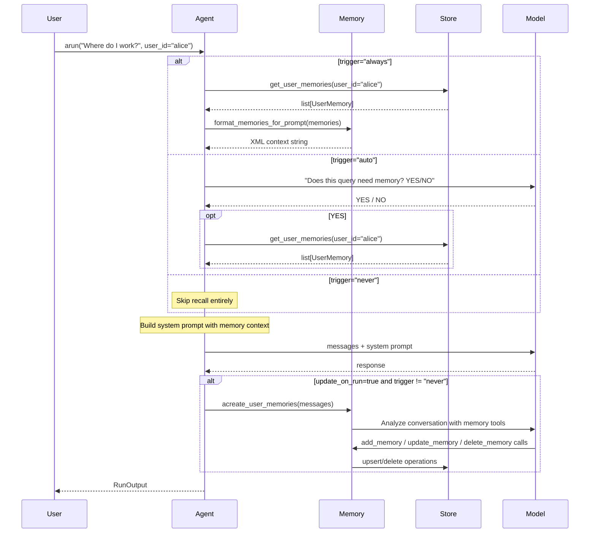

When you pass `memory=` to an `Agent`, the agent automatically injects stored memories before each model call and extracts new memories after each response. The model itself decides what to remember via tool calls.

## Setup

There are two ways to add memory to an agent:

**1. `Memory` instance (recommended)**:

```python
from definable.agent import Agent
from definable.memory import Memory, SQLiteStore
from definable.model.openai import OpenAIChat

agent = Agent(
  model=OpenAIChat(id="gpt-4o"),
  instructions="You are a helpful assistant.",
  memory=Memory(
    store=SQLiteStore("./memory.db"),
    trigger="always",
  ),
)
```

**2. `memory=True`** — ephemeral in-memory store, useful for testing:

```python
agent = Agent(
  model=OpenAIChat(id="gpt-4o"),
  memory=True,  # Uses InMemoryStore, data lost when process exits
)
```

## Execution Flow



1. **Recall** — Before calling the model, the agent loads the user's existing memories from the store and formats them as XML context in the system prompt. The `trigger` setting controls whether this always happens, is gated by a routing model, or is skipped.
2. **Model call** — The model receives the conversation plus any injected memory context.
3. **Update** — After the response, the agent passes the conversation to the memory LLM (which may be the agent's own model). The memory LLM analyzes the conversation and calls `add_memory`, `update_memory`, or `delete_memory` tools to persist relevant facts. This runs as a background task and never blocks the response.

## Trigger Modes

The `trigger` parameter on `Memory` controls when memory recall and storage happen:

| Mode | Recall | Store | When to Use |
|------|--------|-------|-------------|
| `"always"` | Every call | Every call | Most conversational agents |
| `"auto"` | Gated by routing model | Every call | Agents handling mixed queries where only some need personalization |
| `"never"` | Skipped | Skipped | Temporarily disabling memory without removing the configuration |

### `trigger="auto"` with a Routing Model

Pass a cheap model to `routing_model` to avoid the main model performing the gate call:

```python
from definable.agent import Agent
from definable.memory import Memory, SQLiteStore
from definable.model.openai import OpenAIChat

agent = Agent(
  model=OpenAIChat(id="gpt-4o"),
  memory=Memory(
    store=SQLiteStore("./memory.db"),
    trigger="auto",
    routing_model=OpenAIChat(id="gpt-4o-mini"),  # cheap gate call
  ),
)
```

The routing model receives the conversation context and replies YES or NO. On failure (model error, timeout), the gate defaults to YES (fail-open).

## Capability Flags

Memory gives you fine-grained control over what the LLM can do with memories:

```python
memory = Memory(
  store=SQLiteStore("./memory.db"),
  add_memories=True,       # LLM can create new memories (default: True)
  update_memories=True,    # LLM can update existing memories (default: True)
  delete_memories=False,   # LLM can delete memories (default: False)
  clear_memories=False,    # LLM can clear ALL memories (default: False)
)
```

By default, `delete_memories` and `clear_memories` are disabled for safety. Enable them when you want the model to prune outdated or contradictory information:

```python
memory = Memory(
  store=SQLiteStore("./memory.db"),
  delete_memories=True,  # Allow pruning outdated facts
)
```

## Custom Memory Instructions

Control what the memory LLM focuses on:

```python
memory = Memory(
  store=SQLiteStore("./memory.db"),
  memory_capture_instructions=(
    "Focus on the user's technical preferences, programming languages, "
    "frameworks, and development workflow. Ignore general conversation."
  ),
  additional_instructions=(
    "Always tag memories with the relevant programming language."
  ),
)
```

## Multi-User Scoping

Pass `user_id` to scope memories per user:

```python
# Alice's conversation
output = await agent.arun("I prefer dark mode.", user_id="alice")

# Bob's conversation — will not see Alice's preferences
output = await agent.arun("What theme do I prefer?", user_id="bob")
```

The `user_id` flows through `RunContext` and is used for both recall and storage. Each user's memories are fully isolated.

## Multi-Turn Conversations

Memory works alongside session-based multi-turn conversations. Pass previous messages to maintain conversation continuity, while memory handles long-term facts:

```python
# Turn 1
r1 = await agent.arun(
  "My favorite color is blue.",
  user_id="alice",
)

# Turn 2 — pass messages for conversation continuity
r2 = await agent.arun(
  "What's my favorite color?",
  user_id="alice",
  messages=r1.messages,
)
```

<Note>
  `session_id` alone does NOT maintain conversation history. You must pass `messages=r1.messages` for multi-turn context, or use Memory for long-term recall across sessions.
</Note>

## Direct Memory Operations

You can interact with the memory system directly, outside of agent runs:

```python
from definable.memory import Memory, SQLiteStore
from definable.model.openai import OpenAIChat

memory = Memory(
  store=SQLiteStore("./memory.db"),
  model=OpenAIChat(id="gpt-4o-mini"),  # Required for direct use (no agent to borrow from)
)

# Read all memories for a user
memories = await memory.aget_user_memories(user_id="alice")

# Create memories from a message
await memory.acreate_user_memories(
  "Alice just got promoted to Staff Engineer at Acme Corp.",
  user_id="alice",
)

# Run an arbitrary memory task
await memory.aupdate_memory_task(
  "Delete any memories about Alice's old job title",
  user_id="alice",
)

# Optimize/consolidate memories
optimized = await memory.aoptimize_memories(user_id="alice", strategy="summarize")

# Clean up
await memory.close()
```

<Warning>
  When using Memory directly (outside an Agent), you must set the `model` parameter explicitly. Inside an Agent, the memory system borrows the agent's model automatically.
</Warning>

## Memory Optimization

When a user accumulates many memories, you can consolidate them using optimization strategies:

```python
# Summarize: combines related memories into fewer, comprehensive ones
optimized = await memory.aoptimize_memories(
  user_id="alice",
  strategy="summarize",
)
```

The `summarize` strategy uses the LLM to merge related facts, remove duplicates, and produce a smaller set of comprehensive memories. This replaces all existing memories for the user with the consolidated set.

## Non-Fatal Behavior

All memory operations are designed to be non-fatal. If the memory store is unavailable or a memory operation fails, the agent logs a warning and continues normally without memory context:

```python
# Even if the database is unreachable, the agent still works
output = await agent.arun("Hello!")  # Works fine, just without memory context
```

## Debug Mode

Enable `debug_mode` to see what the memory LLM is doing:

```python
memory = Memory(
  store=SQLiteStore("./memory.db"),
  debug_mode=True,  # Logs tool calls, LLM responses, and round counts
)
```

This logs each round of the memory tool loop, including which tools were called and their results, which is useful for understanding why certain facts are or are not being remembered.
