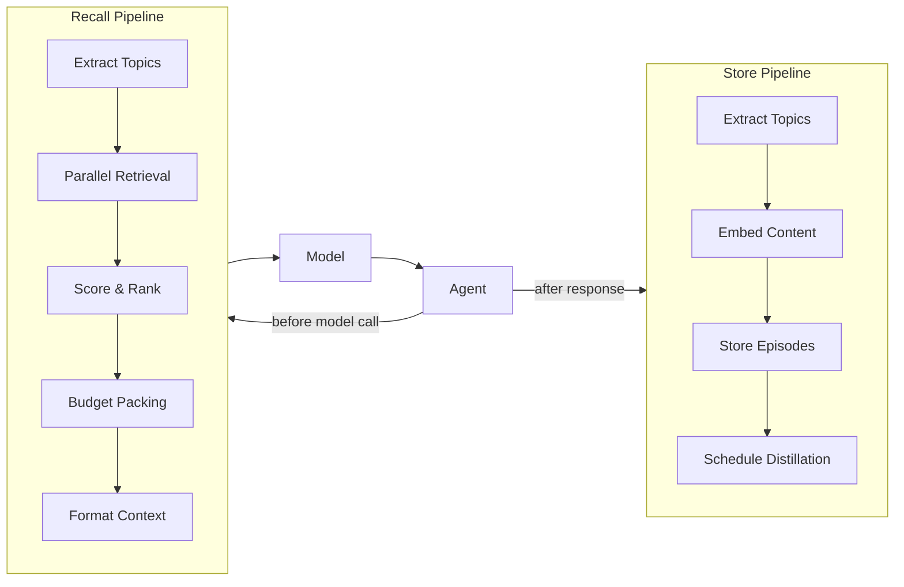

CognitiveMemory gives agents the ability to remember information across conversations. It stores episodes (conversation turns), extracts knowledge atoms (facts), learns procedures (behavioral patterns), and predicts topic transitions — all automatically.

## Quick Example

```python
from definable.agents import Agent
from definable.memory import CognitiveMemory, SQLiteMemoryStore
from definable.models import OpenAIChat

store = SQLiteMemoryStore(db_path="./memory.db")
memory = CognitiveMemory(store=store)

agent = Agent(
  model=OpenAIChat(id="gpt-4o"),
  instructions="You are a helpful assistant.",
  memory=memory,
)

# First conversation — memory stores what it learns
output = agent.run("My name is Alice and I work at Acme Corp.", user_id="alice")

# Later conversation — memory recalls relevant context
output = agent.run("Where do I work?", user_id="alice")
print(output.content)  # "You work at Acme Corp."
```

## How It Works



**Before each model call**, the agent recalls relevant memories and injects them into the system prompt. **After each response**, the agent stores the conversation as new episodes in the background (fire-and-forget).

## Architecture

CognitiveMemory has four memory tiers:

| Tier | Type | Description |
|------|------|-------------|
| **Episodes** | Raw conversations | Individual messages with embeddings, topics, and sentiment |
| **Knowledge Atoms** | Extracted facts | Subject-predicate-object triples (e.g., "Alice works-at Acme Corp") |
| **Procedures** | Behavioral patterns | Trigger-action pairs learned from repeated behavior |
| **Topic Transitions** | Predictive | Tracks which topics follow which, for anticipatory recall |

## CognitiveMemory Constructor

```python
from definable.memory import CognitiveMemory

memory = CognitiveMemory(
  store=store,                    # Required: MemoryStore backend
  token_budget=500,               # Max tokens for recalled context (default: 500)
  embedder=None,                  # Optional: Embedder for semantic search
  distillation_model=None,        # Optional: Model for summarization/extraction
  config=None,                    # Optional: MemoryConfig for fine-tuning
)
```

<ParamField path="store" type="MemoryStore" required>
  The storage backend. See [Memory Stores](/memory/stores) for available options.
</ParamField>

<ParamField path="token_budget" type="int" default={500}>
  Maximum number of tokens to include in the recalled memory context injected into the system prompt.
</ParamField>

<ParamField path="embedder" type="Embedder" default="None">
  An embedder for generating vector representations. When `None`, semantic search falls back to text matching on recent episodes.
</ParamField>

<ParamField path="distillation_model" type="Model" default="None">
  A model used to compress episodes into summaries, facts, and atoms. When `None`, distillation is skipped.
</ParamField>

<ParamField path="config" type="MemoryConfig" default="None">
  Fine-tuning configuration. See [MemoryConfig](#memoryconfig) below.
</ParamField>

## Public Methods

| Method | Description |
|--------|-------------|
| `await recall(query, *, user_id=None, session_id=None)` | Retrieve relevant memories as a `MemoryPayload` |
| `await store_messages(messages, *, user_id=None, session_id=None)` | Store conversation messages as episodes |
| `await run_distillation(*, user_id=None)` | Manually trigger distillation (episode compression) |
| `await forget(*, user_id=None, session_id=None)` | Delete stored memories for a user or session |
| `await close()` | Close the underlying store connection |

CognitiveMemory also supports async context manager (`async with`):

```python
async with CognitiveMemory(store=store) as memory:
    payload = await memory.recall("What's Alice's job?", user_id="alice")
    print(payload.context)
```

## MemoryPayload

The `recall()` method returns a `MemoryPayload`:

| Field | Type | Description |
|-------|------|-------------|
| `context` | `str` | Formatted XML string ready for system prompt injection |
| `tokens_used` | `int` | Number of tokens in the context |
| `chunks_included` | `int` | Number of memory chunks included |
| `chunks_available` | `int` | Total chunks available before budget trimming |

## MemoryConfig

Fine-tune memory behavior with `MemoryConfig`:

```python
from definable.memory import MemoryConfig, ScoringWeights

config = MemoryConfig(
  decay_half_life_days=14.0,          # Recency decay half-life
  scoring_weights=ScoringWeights(
    semantic_similarity=0.35,          # How relevant to current query
    recency=0.25,                      # How recent the memory is
    access_frequency=0.15,             # How often accessed
    predicted_need=0.15,               # Topic transition prediction
    emotional_salience=0.10,           # Sentiment intensity
  ),
  retrieval_top_k=20,                  # Candidates to score
  recent_episodes_limit=5,            # Always include N most recent
  distillation_stage_0_age=3600.0,    # Raw → summary after 1 hour
  distillation_stage_1_age=86400.0,   # Summary → facts after 1 day
  distillation_stage_2_age=604800.0,  # Facts → atoms after 1 week
  distillation_stage_3_age=2592000.0, # Final compression after 30 days
  distillation_batch_size=10,
  reinforcement_boost=0.15,
  topic_transition_min_count=3,
  topic_transition_min_probability=0.3,
)
```

<Note>
The five `ScoringWeights` must sum to 1.0. Validation runs at construction time.
</Note>

## Distillation

Distillation progressively compresses memories over time to stay within storage and retrieval budgets:

| Stage | Name | Triggered After | Description |
|-------|------|----------------|-------------|
| 0 | Raw | — | Original message text |
| 1 | Summary | 1 hour | Condensed version of the episode |
| 2 | Facts | 1 day | Key facts extracted from the summary |
| 3 | Atoms | 1 week | Subject-predicate-object triples |

Distillation requires a `distillation_model` to be set. Without it, episodes remain at stage 0 indefinitely.

## What's Next

<CardGroup cols={2}>
  <Card title="Memory Stores" icon="database" href="/memory/stores">
    Choose a storage backend: SQLite, PostgreSQL, Redis, Qdrant, Chroma, Pinecone, or MongoDB.
  </Card>
  <Card title="Agent Integration" icon="link" href="/memory/agent-integration">
    Learn how memory integrates with the agent lifecycle, events, and multi-user scoping.
  </Card>
</CardGroup>
