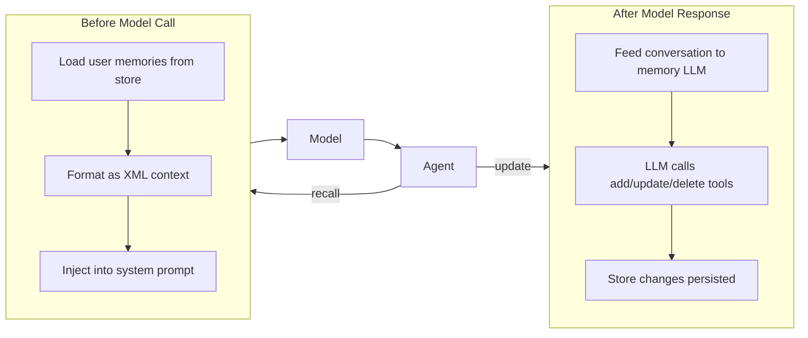

Memory gives agents the ability to remember information about users across conversations. Instead of heuristic scoring or rigid extraction pipelines, the model itself decides what to remember, update, or forget by calling tools (`add_memory`, `update_memory`, `delete_memory`).

## Quick Example

```python
from definable.agent import Agent
from definable.memory import Memory, SQLiteStore
from definable.model.openai import OpenAIChat

agent = Agent(
  model=OpenAIChat(id="gpt-4o"),
  instructions="You are a helpful assistant.",
  memory=Memory(store=SQLiteStore("./memory.db")),
)

# First conversation — the model decides what to remember
output = await agent.arun("My name is Alice and I work at Acme Corp.", user_id="alice")

# Later conversation — stored memories are injected into the prompt
output = await agent.arun("Where do I work?", user_id="alice")
print(output.content)  # "You work at Acme Corp."
```

## How It Works



**Before each model call**, the agent loads the user's existing memories from the store and injects them into the system prompt. **After each response**, the agent passes the conversation to a memory LLM, which uses tool calls to add, update, or delete memories as needed.

## Architecture

Memory uses a simple, flat data model. Each memory is a natural-language statement with topic tags, managed entirely by the LLM:

| Component | Description |
|-----------|-------------|
| **Memory** | Orchestrator that connects a store and an LLM. Controls when memory runs (trigger mode) and which operations the LLM can perform. |
| **UserMemory** | A single fact about a user (e.g., "Alice works at Acme Corp") with topic tags, timestamps, and user/agent scoping. |
| **MemoryStore** | Storage backend protocol. Three built-in implementations: InMemoryStore, SQLiteStore, PostgresStore. |
| **Optimization Strategies** | LLM-driven consolidation of memories (e.g., summarize N memories into fewer comprehensive ones). |

## Memory Constructor

```python
from definable.memory import Memory

memory = Memory(
  store=store,                          # Storage backend (default: InMemoryStore)
  model=None,                           # LLM for memory extraction (default: agent's model)
  trigger="always",                     # "always", "auto", or "never"
  update_on_run=True,                   # Process memories after each agent run
  add_memories=True,                    # LLM can add new memories
  update_memories=True,                 # LLM can update existing memories
  delete_memories=False,                # LLM can delete memories (off by default)
  clear_memories=False,                 # LLM can clear all memories (off by default)
  debug_mode=False,                     # Log debug info during memory operations
  memory_capture_instructions=None,     # What kind of information to capture
  additional_instructions=None,         # Extra instructions for the memory LLM
)
```

<ParamField path="store" type="MemoryStore" default="InMemoryStore()">
  The storage backend. See [Memory Stores](/memory/stores) for available options. When `None`, defaults to an ephemeral `InMemoryStore`.
</ParamField>

<ParamField path="model" type="Model" default="None">
  The LLM used to extract memories from conversations. When `None`, the agent's own model is used at runtime.
</ParamField>

<ParamField path="trigger" type="str" default="always">
  When to activate memory recall and storage: `"always"` (every call), `"auto"` (gated by a routing model), or `"never"` (disabled).
</ParamField>

<ParamField path="update_on_run" type="bool" default={true}>
  Whether to process and store new memories after each agent run.
</ParamField>

<ParamField path="add_memories" type="bool" default={true}>
  Whether the memory LLM can create new memories.
</ParamField>

<ParamField path="update_memories" type="bool" default={true}>
  Whether the memory LLM can update existing memories.
</ParamField>

<ParamField path="delete_memories" type="bool" default={false}>
  Whether the memory LLM can delete memories. Off by default for safety.
</ParamField>

<ParamField path="clear_memories" type="bool" default={false}>
  Whether the memory LLM can clear all memories for a user. Off by default for safety.
</ParamField>

<ParamField path="debug_mode" type="bool" default={false}>
  When enabled, logs tool calls and LLM responses during memory processing.
</ParamField>

<ParamField path="memory_capture_instructions" type="str" default="None">
  Custom instructions for what the memory LLM should capture. Defaults to "Remember important facts about the user."
</ParamField>

<ParamField path="additional_instructions" type="str" default="None">
  Extra instructions appended to the memory LLM's system prompt.
</ParamField>

## Public Methods

| Method | Description |
|--------|-------------|
| `await aget_user_memories(user_id=None)` | Retrieve all memories for a user |
| `await acreate_user_memories(message=None, *, messages=None, user_id=None, agent_id=None)` | Extract and store memories from a message or conversation using the LLM |
| `await aupdate_memory_task(task, *, user_id=None, agent_id=None)` | Run an arbitrary memory task via natural language (e.g., "Forget the user's old address") |
| `await aoptimize_memories(user_id=None, strategy=None)` | Consolidate memories using an optimization strategy |
| `format_memories_for_prompt(memories)` | Format a list of `UserMemory` objects as an XML string for prompt injection |
| `await close()` | Close the underlying store connection |

### Reading Memories

```python
memories = await memory.aget_user_memories(user_id="alice")
for m in memories:
  print(f"[{m.memory_id}] {m.memory} (topics: {m.topics})")
```

### Creating Memories from a Conversation

```python
# From a single message
await memory.acreate_user_memories(
  "I just moved to San Francisco and started a new job at Stripe.",
  user_id="alice",
)

# From a list of Message objects
await memory.acreate_user_memories(
  messages=conversation_messages,
  user_id="alice",
)
```

### Running Arbitrary Memory Tasks

```python
await memory.aupdate_memory_task(
  "Update Alice's job title to Senior Engineer",
  user_id="alice",
)
```

### Optimizing Memories

When a user accumulates many memories, you can consolidate them:

```python
optimized = await memory.aoptimize_memories(
  user_id="alice",
  strategy="summarize",  # Combines related memories into fewer, comprehensive ones
)
print(f"Consolidated to {len(optimized)} memories")
```

## UserMemory

Each memory is represented as a `UserMemory` dataclass:

| Field | Type | Default | Description |
|-------|------|---------|-------------|
| `memory` | `str` | — | The memory content (natural language fact) |
| `memory_id` | `str` | Auto-generated UUID | Unique identifier |
| `topics` | `list[str]` | `[]` | LLM-assigned topic tags |
| `user_id` | `str \| None` | `None` | User this memory belongs to |
| `agent_id` | `str \| None` | `None` | Agent that created this memory |
| `input` | `str \| None` | `None` | Original user message that triggered this memory |
| `created_at` | `float` | Auto-set | Unix timestamp when created |
| `updated_at` | `float` | Auto-set | Unix timestamp when last updated |

`UserMemory` supports serialization via `to_dict()` and `UserMemory.from_dict(data)`.

## What's Next

<CardGroup cols={2}>
  <Card title="Memory Stores" icon="database" href="/memory/stores">
    Choose a storage backend: InMemory, SQLite, or PostgreSQL.
  </Card>
  <Card title="Agent Integration" icon="link" href="/memory/agent-integration">
    Learn how memory integrates with the agent lifecycle, trigger modes, and multi-user scoping.
  </Card>
</CardGroup>
