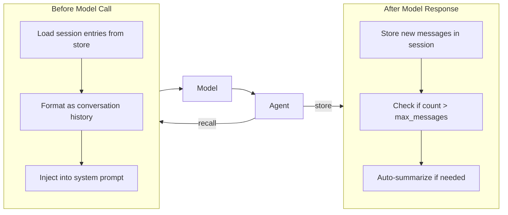

Memory gives agents the ability to maintain conversation history across turns, with automatic summarization when history grows beyond a configurable limit. Instead of storing individual facts, Memory preserves the full conversation flow and intelligently compresses older messages to stay within token budgets.

## Quick Example

```python
from definable.agent import Agent
from definable.memory import Memory, SQLiteStore
from definable.model.openai import OpenAIChat

agent = Agent(
  model=OpenAIChat(id="gpt-4o"),
  instructions="You are a helpful assistant.",
  memory=Memory(store=SQLiteStore("./memory.db")),
)

# First conversation — history is stored automatically
output = await agent.arun("My name is Alice and I work at Acme Corp.", user_id="alice")

# Later conversation — previous history is injected into the prompt
output = await agent.arun("Where do I work?", user_id="alice")
print(output.content)  # "You work at Acme Corp."
```

## How It Works



**Before each model call**, the agent loads the session's conversation entries and injects them as context. **After each response**, the agent stores the new messages. When the entry count exceeds `max_messages`, a summarization strategy runs automatically — pinning the first few messages, summarizing the middle, and keeping the most recent messages intact.

## Architecture

| Component | Description |
|-----------|-------------|
| **Memory** | Orchestrator that connects a store and optional model for summarization. Controls max message limits and summarization parameters. |
| **MemoryEntry** | A single conversation entry with session/user scoping, role, content, and timestamps. |
| **MemoryStore** | Storage backend protocol. Three built-in implementations: InMemoryStore, SQLiteStore, FileStore. |
| **SummarizeStrategy** | Hybrid pin + summarize-middle + keep-recent strategy for compressing long conversations. |

## Memory Constructor

```python
from definable.memory import Memory

memory = Memory(
  store=store,              # Storage backend (default: InMemoryStore)
  model=None,               # LLM for summarization (default: agent's model)
  enabled=True,             # Whether memory is active
  max_messages=100,         # Auto-summarize when entries exceed this count
  pin_count=2,              # Number of earliest messages to always preserve
  recent_count=5,           # Number of most recent messages to always preserve
  description=None,         # Description for the agent layer guide
)
```

<ParamField path="store" type="MemoryStore" default="InMemoryStore()">
  The storage backend. See [Memory Stores](/memory/stores) for available options. When `None`, defaults to an ephemeral `InMemoryStore`.
</ParamField>

<ParamField path="model" type="Model" default="None">
  The LLM used for summarization when entries exceed `max_messages`. When `None`, the agent's own model is used at runtime.
</ParamField>

<ParamField path="enabled" type="bool" default={true}>
  Whether memory recall and storage are active. Set to `False` to temporarily disable without removing the configuration.
</ParamField>

<ParamField path="max_messages" type="int" default={100}>
  When the entry count exceeds this, the `SummarizeStrategy` runs automatically to compress older messages.
</ParamField>

<ParamField path="pin_count" type="int" default={2}>
  Number of earliest messages to always preserve during summarization. These provide initial context.
</ParamField>

<ParamField path="recent_count" type="int" default={5}>
  Number of most recent messages to always preserve during summarization. These provide current context.
</ParamField>

## Public Methods

| Method | Description |
|--------|-------------|
| `await add(message, session_id, user_id)` | Add a message to the session history |
| `await get_entries(session_id, user_id)` | Retrieve all entries for a session |
| `await get_context_messages(session_id, user_id)` | Get entries as `Message` objects for prompt injection |
| `await update(memory_id, content)` | Update a specific entry's content |
| `await delete(memory_id)` | Delete a specific entry |
| `await clear(session_id, user_id)` | Clear all entries for a session |
| `await close()` | Close the underlying store connection |

### Adding and Retrieving Entries

```python
from definable.model.message import Message

await memory.add(Message(role="user", content="Hello!"), session_id="s1")
await memory.add(Message(role="assistant", content="Hi there!"), session_id="s1")

entries = await memory.get_entries("s1")
for e in entries:
  print(f"[{e.role}] {e.content}")
```

### Getting Context Messages

```python
messages = await memory.get_context_messages("s1")
# Returns list[Message] — ready for prompt injection
```

## MemoryEntry

Each conversation entry is represented as a `MemoryEntry` dataclass:

| Field | Type | Default | Description |
|-------|------|---------|-------------|
| `session_id` | `str` | — | Session this entry belongs to |
| `memory_id` | `str \| None` | Auto-generated UUID | Unique identifier |
| `user_id` | `str` | `"default"` | User this entry belongs to |
| `role` | `str` | `"user"` | Message role: `"user"`, `"assistant"`, or `"summary"` |
| `content` | `str` | `""` | The message content |
| `message_data` | `dict \| None` | `None` | Optional structured data (e.g., tool calls) |
| `created_at` | `float \| None` | Auto-set | Unix timestamp when created |
| `updated_at` | `float \| None` | Auto-set | Unix timestamp when last updated |

## What's Next

<CardGroup cols={2}>
  <Card title="Memory Stores" icon="database" href="/memory/stores">
    Choose a storage backend: InMemory, SQLite, or file-based.
  </Card>
  <Card title="Agent Integration" icon="link" href="/memory/agent-integration">
    Learn how memory integrates with the agent lifecycle and multi-user scoping.
  </Card>
</CardGroup>
